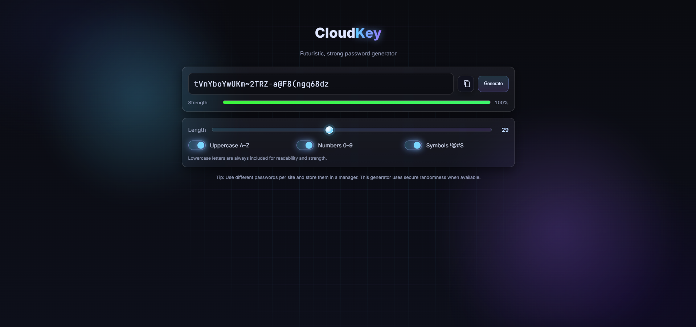

# 🔐 Strong Password Generator

A sleek and modern **strong password generator** web app that helps users create secure, random passwords instantly.  
Built with **HTML, TailwindCSS**, and **JavaScript**, with a focus on a clean and interactive front-end experience.



---

## ✨ Features
- 📜 **Customizable Length** – Adjust password length with a slider.
- 🔡 **Character Options** – Include uppercase letters, lowercase letters, numbers, and symbols.
- 🎯 **Password Strength Meter** – Real-time visual strength indicator (Weak, Medium, Strong).
- 📋 **Copy to Clipboard** – One-click password copying.
- 🌙 **Dark Mode UI** – Futuristic glassmorphism design with neon accents.
- ⚡ **Fast & Secure** – Generates passwords instantly on the client side.

---

## 🖥️ Tech Stack
- **Frontend:** HTML, TailwindCSS, JavaScript
- **Styling:** TailwindCSS + Custom animations
- **Icons:** [Lucide Icons](https://lucide.dev/) / [Font Awesome](https://fontawesome.com/)

---

## 🚀 Getting Started

### 1️⃣ Clone the repository
```bash
git clone https://github.com/yourusername/strong-password-generator.git
cd strong-password-generator
```

### 2️⃣ Open in browser
Simply open the `index.html` file in your browser.

---

## 📸 Screenshots


---

## 🛠️ How It Works
1. User chooses **password length**.
2. Toggles which character sets to include.
3. JavaScript generates a random password based on chosen settings.
4. Password strength is calculated and displayed in real-time.

---

## 💡 Future Enhancements
- Save favorite passwords locally.
- Option to generate **passphrases** (e.g., "correct-horse-battery-staple").
- Add **mobile app version** with PWA support.
- Multi-language support.

---

## 📜 License
This project is licensed under the [MIT License](LICENSE).

---

## 👨‍💻 Author
**Your Name**  
🔗 [My Card](https://fluidcloudcard.netlify.app/) | 📷 [Instagram](https://www.instagram.com/nash.x0x/)

---
⭐ *If you found this project helpful, please give it a star on GitHub!*
